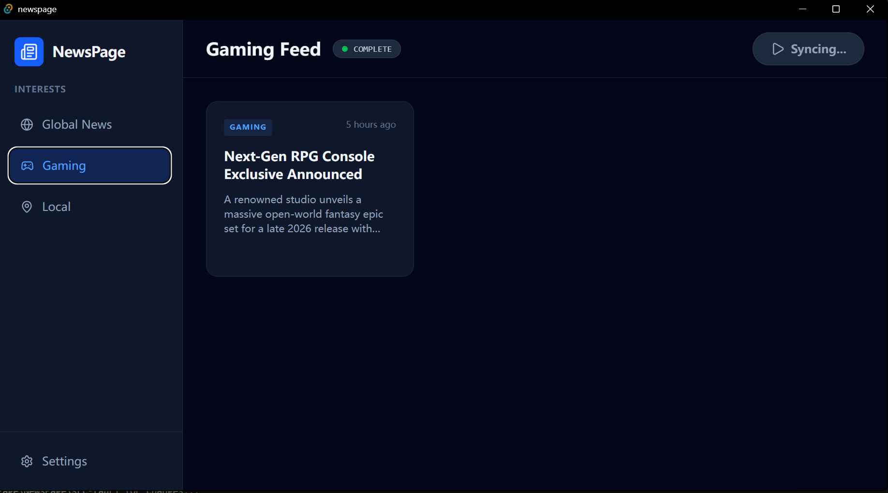

# NewsPage: Local AI News Aggregator

A privacy-first, desktop news aggregation application powered entirely by local, small-parameter Large Language Models (<4B). NexNews fetches, categorizes, and summarizes news using Retrieval-Augmented Generation (RAG) while ensuring zero data leakage to cloud APIs and giving users absolute control over computational resources.

## ✨ Core Features

* **100% Local AI Processing:** Utilizes local models via Ollama (e.g., Phi-3, Qwen) for all summarization and tagging operations.
* **Zero-Waste Compute:** Operates on an explicit "Start Processing" interaction model. The app remains completely dormant, consuming zero CPU/GPU resources until manually triggered.
* **Anti-Hallucination RAG Pipeline:** Grounds LLM summaries strictly in fetched article text using a local vector database to prevent fabricated information.
* **Intelligent Categorization:** Automatically sorts unstructured news feeds into semantic categories based on user interests.
* **Native Performance:** Built with Tauri and Rust for a lightweight, high-performance native OS experience with a minimal RAM footprint compared to Electron.

## 🛠️ Technology Stack

* **Frontend:** React (TypeScript), Tailwind CSS
* **Framework:** Tauri (WebView2)
* **Backend / System Interop:** Rust
* **AI Engine:** Ollama (Local LLM & Embeddings)
* **Database:** SQLite (Metadata/Preferences) + Local Vector DB (e.g., Qdrant or `sqlite-vss` for RAG)

## 🗺️ Development Roadmap

### Phase 1: Environment Setup & Prototyping

* [ ] Initialize Tauri project with React and Tailwind.
* [ ] Install Ollama and benchmark <4B parameter models for speed and logic.
* [ ] Build static UI skeleton (Grid/Card layout, "Start Processing" master button).
* [ ] Initialize local SQLite database with `Articles`, `Categories`, and `UserPreferences` schemas.

### Phase 2: Data Ingestion & RAG Foundation

* [ ] Write Rust backend routines to fetch data from Google News/RSS APIs.
* [ ] Wire the "Start Processing" UI trigger to the Rust fetch sequence.
* [ ] Integrate local vector storage for article embeddings.
* [ ] Configure embedding generation via Ollama (e.g., `nomic-embed-text`) for the fetched text.

### Phase 3: The AI Pipeline

* [ ] Implement RAG retrieval logic to match user interests against stored vectors.
* [ ] Design strict system prompts for the local LLM to enforce JSON formatting and eliminate hallucinations.
* [ ] Create the core processing loop: Fetch -> Embed -> Retrieve -> Summarize/Tag -> Save to SQLite.

### Phase 4: UI Integration & Refinement

* [ ] Establish Tauri IPC (Inter-Process Communication) to send processed data from Rust to React.
* [ ] Dynamically render UI cards with AI-generated titles, summaries, and tags.
* [ ] Implement detailed view for full summaries and original source links.
* [ ] Add dynamic UI states (loading indicators, progress bars during LLM processing).

### Phase 5: Testing & Packaging

* [ ] Profile system resources to verify zero background usage when idle.
* [ ] Implement error handling for API limits, network drops, and Ollama timeouts.
* [ ] Compile final Windows executable (`.msi` or `.exe`) using Tauri build tools.
